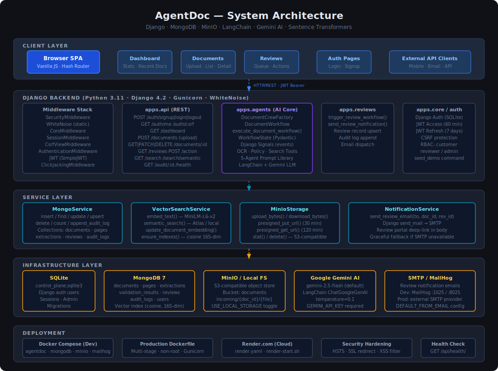
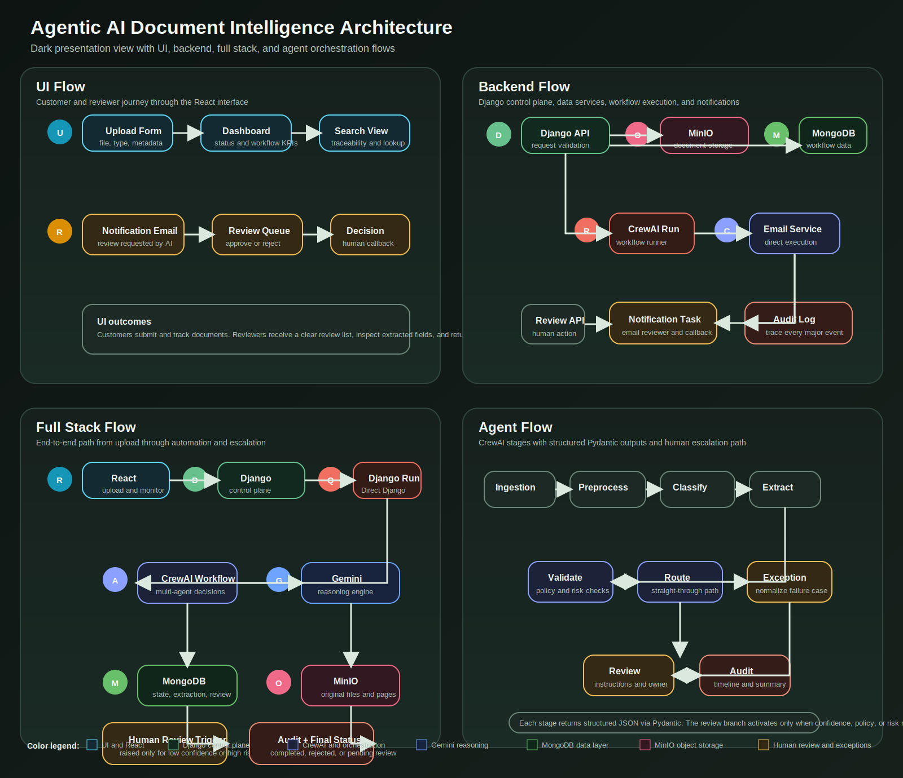
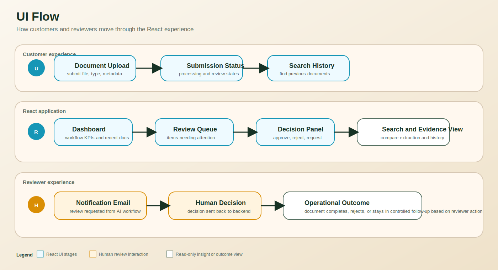
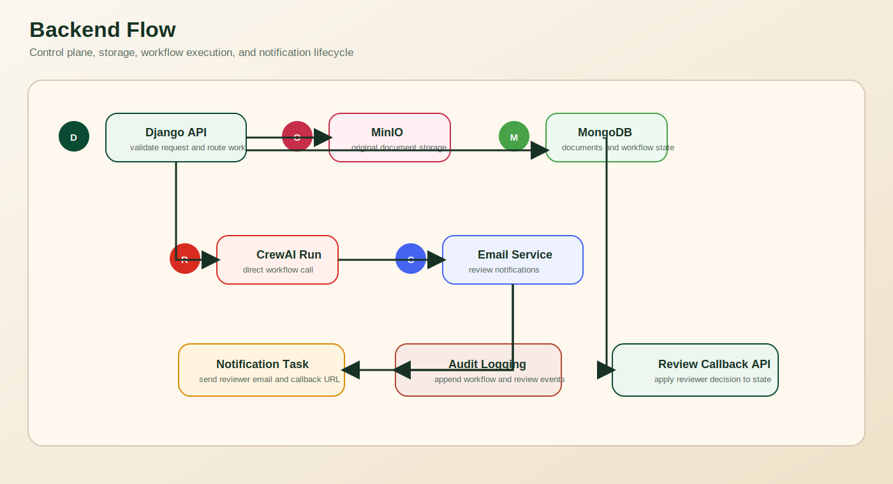
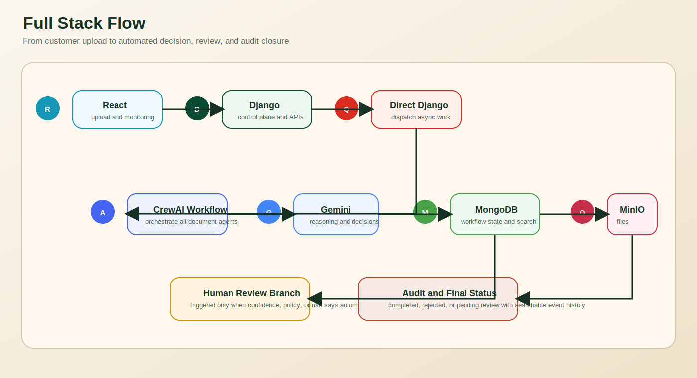
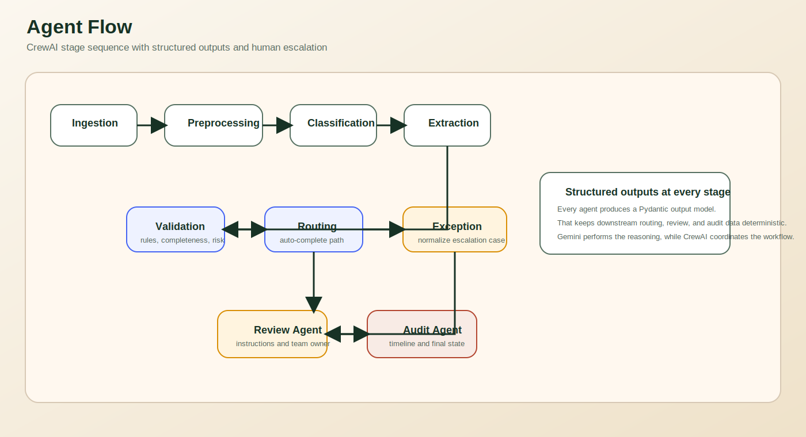
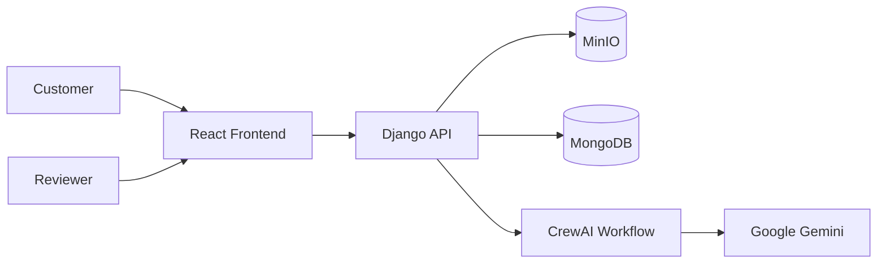

# Architecture

## Overview Assets

### Light Version

### Dark Version

## Focused Diagrams

### UI Flow Diagram

### Backend Flow Diagram

### Full Stack Flow Diagram

### Agent Flow Diagram

## Architecture Views

### UI Flow
- customer uploads document
- user tracks status and history
- reviewer processes queue items
- semantic search retrieves relevant documents

### Backend Flow
- Django validates request and JWT identity
- MinIO stores binary object
- MongoDB stores workflow state
- CrewAI executes sequential multi-agent reasoning with Pydantic outputs
- Django sends SMTP notifications for review tasks
- agent stage events append audit logs via Django signals

### Full Stack Flow
- React -> Django API -> CrewAI -> Gemini
- Django persists state to MongoDB and file objects to MinIO
- human review callbacks update records and close workflow loop

### Agent Flow
- Ingestion
- Preprocessing
- Classification
- Extraction
- Validation
- Routing
- Exception
- Review
- Audit

## High-Level Diagram

