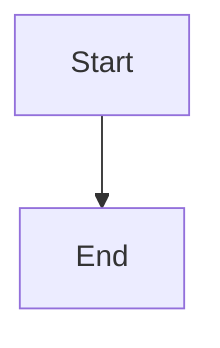

# Viewing Mermaid Diagrams

Guide to viewing the architecture diagrams in AgentDoc.

## 📊 Available Diagrams

We have 4 comprehensive Mermaid diagrams in `docs/assets/`:

1. **agent-workflow.mmd** - 5-agent sequential processing
2. **deployment-architecture.mmd** - Render deployment structure
3. **architecture-complete.mmd** - Complete system architecture
4. **data-flow.mmd** - Sequence diagram of data flow

## 🔍 Viewing Options

### Option 1: GitHub (Easiest)

GitHub natively renders Mermaid diagrams!

1. Navigate to `docs/assets/` on GitHub
2. Click on any `.mmd` file
3. GitHub will automatically render the diagram

**Example**: 
```
https://github.com/your-repo/AgentDoc/blob/main/docs/assets/agent-workflow.mmd
```

### Option 2: Mermaid Live Editor

1. Go to https://mermaid.live
2. Copy the content from any `.mmd` file
3. Paste into the editor
4. View the rendered diagram
5. Export as PNG/SVG if needed

### Option 3: VS Code Extension

1. Install "Markdown Preview Mermaid Support" extension
2. Open any `.mmd` file
3. Right-click → "Open Preview"
4. View the rendered diagram

**Extension**: `bierner.markdown-mermaid`

### Option 4: Markdown Files

Create a markdown file and embed the diagram:

```markdown
# My Diagram


```

Then view with any Markdown preview tool.

### Option 5: Online Viewers

**Mermaid Chart**
- https://www.mermaidchart.com
- Professional diagram editor
- Collaboration features

**Kroki**
- https://kroki.io
- Supports multiple diagram types
- API available

## 📝 Diagram Descriptions

### 1. agent-workflow.mmd

**Purpose**: Shows the sequential 5-agent processing pipeline

**Key Elements**:
- 5 agent subgraphs
- Data flow between agents
- Decision points (routing)
- Queue assignments
- Human review loop

**Best For**: Understanding the workflow

### 2. deployment-architecture.mmd

**Purpose**: Shows Render deployment structure

**Key Elements**:
- 3 Render services
- External services (MongoDB, Gemini)
- Environment variables
- Free tier limitations
- Service communication

**Best For**: Understanding deployment

### 3. architecture-complete.mmd

**Purpose**: Complete system architecture

**Key Elements**:
- All system layers
- User interactions
- API layer
- 5-agent system
- AI services
- Data layer
- Feedback loops

**Best For**: Overall system understanding

### 4. data-flow.mmd

**Purpose**: Sequence diagram of complete flow

**Key Elements**:
- User journey
- API calls
- Agent execution sequence
- Database operations
- Human review process
- Status updates

**Best For**: Understanding interactions

## 🎨 Color Coding

Our diagrams use consistent color coding:

- **Green** (`#e8f5e9`) - Agents and services
- **Blue** (`#e1f5ff`) - Queues and data stores
- **Orange** (`#fff3e0`) - Decisions and routing
- **Pink** (`#fce4ec`) - Human interactions
- **Purple** (`#f3e5f5`) - Configuration
- **Red** (`#ffebee`) - Warnings and notes

## 📥 Exporting Diagrams

### From Mermaid Live Editor

1. Open diagram in https://mermaid.live
2. Click "Actions" menu
3. Choose export format:
   - PNG (raster image)
   - SVG (vector image)
   - PDF (document)

### From VS Code

1. Install "Markdown PDF" extension
2. Open markdown file with diagram
3. Right-click → "Markdown PDF: Export (png)"

### From Command Line

Using `mmdc` (Mermaid CLI):

```bash
# Install
npm install -g @mermaid-js/mermaid-cli

# Convert to PNG
mmdc -i docs/assets/agent-workflow.mmd -o agent-workflow.png

# Convert to SVG
mmdc -i docs/assets/agent-workflow.mmd -o agent-workflow.svg
```

## 🔧 Editing Diagrams

### Syntax Reference

**Graph Direction**:
```mermaid
graph TD  # Top to Down
graph LR  # Left to Right
graph TB  # Top to Bottom
```

**Node Shapes**:
```mermaid
A[Rectangle]
B(Rounded)
C([Stadium])
D[[Subroutine]]
E[(Database)]
F((Circle))
G>Flag]
H{Diamond}
```

**Connections**:
```mermaid
A --> B   # Arrow
A --- B   # Line
A -.-> B  # Dotted arrow
A ==> B   # Thick arrow
```

**Subgraphs**:
```mermaid
subgraph "Title"
    A --> B
end
```

**Styling**:
```mermaid
classDef className fill:#color,stroke:#color
class A,B className
```

### Mermaid Documentation

Official docs: https://mermaid.js.org/intro/

## 🐛 Troubleshooting

### Diagram Not Rendering

**Problem**: Diagram shows as code block

**Solutions**:
1. Check syntax errors
2. Ensure proper code fence: ` ```mermaid `
3. Use a Mermaid-compatible viewer
4. Try Mermaid Live Editor

### Syntax Errors

**Problem**: Diagram fails to render

**Solutions**:
1. Check for missing quotes
2. Verify node IDs are unique
3. Check arrow syntax
4. Validate in Mermaid Live Editor

### Large Diagrams

**Problem**: Diagram is too large

**Solutions**:
1. Export as SVG for scalability
2. Split into multiple diagrams
3. Use subgraphs for organization
4. Adjust zoom in viewer

## 📚 Additional Resources

### Official Resources
- **Mermaid Docs**: https://mermaid.js.org
- **Live Editor**: https://mermaid.live
- **GitHub Support**: https://github.blog/2022-02-14-include-diagrams-markdown-files-mermaid/

### Tutorials
- **Mermaid Tutorial**: https://mermaid.js.org/intro/getting-started.html
- **Diagram Types**: https://mermaid.js.org/intro/syntax-reference.html

### Tools
- **VS Code Extension**: Markdown Preview Mermaid Support
- **CLI Tool**: @mermaid-js/mermaid-cli
- **Online Editor**: https://www.mermaidchart.com

## 💡 Tips

1. **Start Simple**: Begin with basic diagrams, add complexity gradually
2. **Use Subgraphs**: Organize related nodes together
3. **Color Code**: Use consistent colors for component types
4. **Add Comments**: Use `%%` for comments in Mermaid
5. **Test Often**: Validate in Live Editor frequently
6. **Export Early**: Save rendered versions for presentations

## 📞 Support

If you have issues viewing diagrams:
1. Check this guide first
2. Try Mermaid Live Editor
3. Verify syntax in official docs
4. Open an issue on GitHub

---

**Happy Diagramming!** 📊✨
