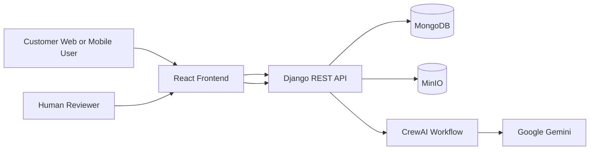
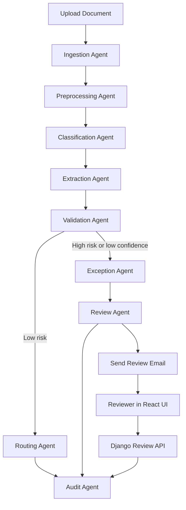

# 1 Project Overview

## Title
Agentic AI Document Intelligence System for Autonomous Workflow Automation

## Mission
Build a B2C-focused full-stack platform that autonomously ingests, understands, validates, routes, and audits customer-submitted documents such as KYC forms, invoices, receipts, claims, shipping documents, loan applications, contracts, and handwritten forms.

## What makes it agentic
- Each stage is handled by a dedicated CrewAI agent with a structured Pydantic output.
- Agents use Google Gemini for reasoning and decisioning.
- Confidence-driven exception handling routes edge cases to people through a Django-managed human review workflow.
- Workflow execution is direct inside Django in this codebase, without Redis or Celery.

# 2 Architecture

## Logical architecture


## Runtime component responsibilities
- React: Upload portal, review queue, semantic search, and document status dashboard.
- Django: System of control for APIs, workflow execution, review actions, notifications, search endpoints, and operational state.
- CrewAI: Orchestrates sequential and conditional agent execution.
- Gemini: Executes reasoning, classification, validation decisions, and structured outputs.
- MongoDB: Stores document metadata, page artifacts, extractions, validation results, reviews, users, and audit logs.
- MinIO: Stores original files, page-level derivatives, and review attachments.
- MailHog: Captures local review notifications during development.

## Communication model
- API submission creates a `documents` record and stores the file in MinIO.
- Django runs the CrewAI workflow immediately.
- CrewAI agents execute stage-by-stage and persist structured outputs to MongoDB.
- If review is needed, Django sends reviewer email directly.
- Reviewer acts from React UI.
- Django records the decision, updates MongoDB, and appends audit events.

# 3 Technology Stack
- Frontend: React + Vite
- Backend: Python + Django + Django REST Framework
- Agent framework: CrewAI
- LLM: Google Gemini
- Database: MongoDB local for development and MongoDB Atlas for hosting
- Vector layer: optional MongoDB Atlas Vector Search
- Object storage: MinIO
- OCR: Tesseract or PaddleOCR integration point
- Embeddings: sentence-transformers local fallback
- Email testing: MailHog
- Containerization: Docker + Docker Compose

# 4 Agent System

## Agent catalog
| Agent | Responsibility | Input | Output Model |
|---|---|---|---|
| Ingestion Agent | Validate intake metadata and readiness | File metadata, user context | `IngestionOutput` |
| Preprocessing Agent | Assess quality, orientation, OCR readiness | Stored file, page previews | `PreprocessingOutput` |
| Classification Agent | Detect document type and customer intent | OCR text, metadata | `ClassificationOutput` |
| Extraction Agent | Extract required business fields with evidence | Classified type, OCR text | `ExtractionOutput` |
| Validation Agent | Check completeness and policy rules | Extracted fields, policy rules | `ValidationOutput` |
| Routing Agent | Select downstream path and SLA | Validation status, customer segment | `RoutingOutput` |
| Exception Agent | Standardize failure cases and fallback actions | Failed checks, low confidence | `ExceptionOutput` |
| Review Agent | Prepare reviewer instructions and due time | Exception and routing context | `ReviewOutput` |
| Audit Agent | Generate final traceable summary | Full workflow state | `AuditOutput` |

## CrewAI code structure
- `backend/apps/agents/schemas.py`
- `backend/apps/agents/prompts/library.py`
- `backend/apps/agents/tools/document_tools.py`
- `backend/apps/agents/crew.py`
- `backend/apps/agents/workflow.py`
- `backend/apps/agents/runner.py`

# 5 Workflow Pipeline

## End-to-end pipeline


# 6 Database Design

## MongoDB collections
- `documents`
- `pages`
- `extractions`
- `validation_results`
- `reviews`
- `audit_logs`
- `users`

## Local MongoDB to hosted MongoDB migration
The app reads `MONGODB_URI` and `MONGODB_DB_NAME` from environment only. Moving from local MongoDB Community Edition to hosted MongoDB Atlas requires configuration change, not code change.

# 7 APIs
- `GET /api/health/`
- `GET /api/dashboard/`
- `GET /api/documents/`
- `POST /api/documents/`
- `GET /api/documents/{document_id}/`
- `GET /api/reviews/`
- `POST /api/reviews/{document_id}/action/`
- `GET /api/search/?q=...`

## API design principles
- Upload processing is synchronous in the current implementation.
- Human actions are auditable.
- All agent outputs remain inspectable.

# 8 Frontend Design
- Dashboard
- Documents intake and monitoring
- Human review queue
- Search

# 9 Human-in-the-Loop & Notification System

## Notification strategy
- Review records are stored in MongoDB.
- Django sends email with direct link to the React review screen.
- MailHog captures email in local development.
- Notification events are stored in `audit_logs`.

## Review lifecycle states
- `pending_agent_decision`
- `await_human`
- `in_progress`
- `complete`

# 10 Deployment

## Docker Compose services included
- `django-api`
- `react-web`
- `mongodb`
- `minio`
- `createbucket`
- `mailhog`

## Self-hosted and optional Atlas deployment
- Frontend served from a React build behind Nginx or another self-hosted reverse proxy
- Django deployed with Docker Compose or self-managed Kubernetes
- MongoDB Community Edition for local development or MongoDB Atlas for hosted deployment
- MinIO remains self-hosted object storage
- MailHog is replaced with a real SMTP provider in hosted environments

# 11 Example Data Flow
1. Customer uploads a loan application from the React web app.
2. Django stores the file in MinIO and writes a `documents` record in MongoDB.
3. Django runs the CrewAI workflow.
4. CrewAI workflow runs Ingestion, Preprocessing, Classification, Extraction, and Validation agents.
5. Validation detects a mismatch between declared income and supporting document evidence.
6. Exception Agent labels it `policy_conflict`.
7. Review Agent assigns the item to operations with 30-minute SLA.
8. Django sends an email to the reviewer.
9. Reviewer opens the React queue, inspects the extracted values, and requests changes.
10. Django updates the `reviews` and `documents` collections.
11. Audit Agent summary and manual action trail remain searchable.

# 12 Example JSON Output

## Example extraction JSON
```json
{
  "document_id": "doc_8c2f4b1a9012",
  "document_type": "invoice",
  "fields": [
    {
      "field_name": "invoice_number",
      "value": "INV-1001",
      "confidence": 0.98,
      "source_page": 1,
      "evidence": "Invoice No: INV-1001"
    }
  ],
  "missing_fields": [],
  "next_action": "validate",
  "reasons": [
    "Invoice template matched with high confidence.",
    "All mandatory finance fields were extracted."
  ]
}
```
